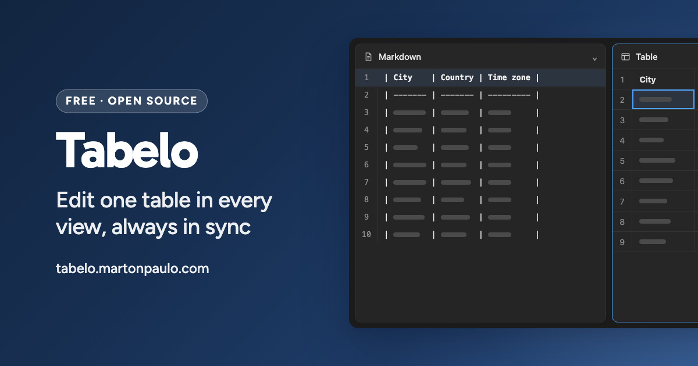

<div align="center">



# Tabelo

Edit one table as a grid, Markdown, CSV, TSV, HTML, Jira, JSON or records, with every view
synchronized and everything running in your browser.

[](https://github.com/martonpaulo/tabelo/actions/workflows/validate.yml) [](https://github.com/martonpaulo/tabelo/actions/workflows/deploy.yml)

[](https://react.dev) [](https://vite.dev) [](https://www.typescriptlang.org)

</div>

Tabelo is a table editor for the moments when a spreadsheet is **too much**, but hand-editing pipes
and commas is no fun either. Change a cell in the visual table and the Markdown updates. Fix the CSV
and the table updates. Open up to **four views at once** and they all stay in sync. Everything runs
in your browser: **no account, no server, no upload**.

**Tabelo** is the word for table in the [language Esperanto](https://www.youtube.com/watch?v=whGSkjXTPjU).
It exists because moving a table between a wiki, a ticket, a spreadsheet and a code review usually
means retyping it, and every retype is a chance to lose a line break, an alignment marker or a
leading zero. Here **one canonical document** backs every format, so a round trip through CSV or
Jira and back leaves the table exactly as it was.

---

<br />

## 🌱 Quick Start

Requires [Node.js](https://nodejs.org) 24+ and [pnpm](https://pnpm.io) 11+.

```bash
pnpm install
pnpm dev
```

Then open the URL it prints, which on a plain checkout and in CI is
[http://localhost:3001](http://localhost:3001).

Every other worktree gets its own port derived from its path, so several checkouts can run side by
side without serving each other's build.

<br />

## 🛠 Commands

| Command                 | What it does                                   |
| :---------------------- | :--------------------------------------------- |
| `pnpm validate`         | The full gate before a commit                  |
| `pnpm dev`              | Dev server                                     |
| `pnpm build`            | Production build                               |
| `pnpm test`             | Unit and property tests                        |
| `pnpm test:watch`       | Unit tests, re-running on change               |
| `pnpm test:unit`        | Unit tests only                                |
| `pnpm test:property`    | Property tests only                            |
| `pnpm bench`            | Benchmarks                                     |
| `pnpm test:e2e:install` | Install Chromium for browser tests             |
| `pnpm test:e2e`         | Browser tests in Chromium                      |
| `pnpm test:e2e:failed`  | Only the tests that failed last time           |
| `pnpm test:e2e:changed` | Only the specs affected by uncommitted changes |
| `pnpm test:e2e:ui`      | Playwright's watch and time-travel interface   |
| `pnpm test:e2e:serve`   | Build once and keep the preview server warm    |
| `pnpm check-types`      | TypeScript                                     |
| `pnpm lint`             | Biome check                                    |
| `pnpm check`            | Biome check, writing fixes                     |
| `pnpm check:dead-code`  | Knip, for unused files, exports and dependencies |

`pnpm test:e2e` builds and serves the app itself. `test:e2e:serve` is worth starting first when a fix
needs several `test:e2e:failed` rounds: the suite reuses that server and skips the build and boot
each time.

Property tests run 100 generated cases per invariant. A failure reports its `seed`, `path`, and
minimal counterexample. Replay it by temporarily passing the reported `{ seed, path }` beside
`numRuns` in that `test.prop` call, then run the focused spec. Keep the property after the fix. Add
the shrunk example as an ordinary regression test only when it communicates a distinct contract more
clearly than the property itself.

Chromium is the only browser the suite runs, locally and in CI, because it is the only browser Tabelo
supports. There is no second project to opt into and no cross-browser command to remember before
opening a pull request.

> [!TIP]
> Before you commit: `pnpm validate` — that is `pnpm check`, `pnpm check:dead-code`,
> `pnpm check-types` and `pnpm test`. Add `pnpm test:e2e` when the change crosses a UI boundary,
> which is the coverage CI selects for you anyway.

<br />

## 🔐 Secrets and variables

There is no application secret to configure: Tabelo has no backend, no API key and no account. Both
workflows use only the `GITHUB_TOKEN` that GitHub Actions provides on its own.

| Variable               | Where           | What it does                                                     |
| :--------------------- | :-------------- | :--------------------------------------------------------------- |
| `BASE_PATH`            | Build           | Public base path of the built site. Defaults to `/`; the deploy workflow sets it explicitly |
| `SITE_ORIGIN`          | Build           | Absolute origin used in the page metadata and social card tags    |
| `TABELO_DEV_PORT`      | Local dev       | Overrides the path-derived dev server port                        |
| `TABELO_PREVIEW_PORT`  | Local dev       | Overrides the path-derived preview server port                    |
| `TABELO_PWA_DEV`       | Local dev       | Enables the service worker in dev, for working on the worker itself |
| `CI`                   | CI              | Set by GitHub Actions; pins the canonical ports and the Playwright retry policy |

---

<br />

## Here is the whole idea

These are not separate files. They are the same table:

**Grid**

| Name   |   Role    | Active |
| :----- | :-------: | -----: |
| Ingrid | Designer  |    Yes |
| Paulo  | Developer |     No |

**Markdown**: alignment and all

```markdown
| Name   |   Role    | Active |
| :----- | :-------: | -----: |
| Ingrid | Designer  |    Yes |
| Paulo  | Developer |     No |
```

**CSV**

```csv
Name,Role,Active
Ingrid,Designer,Yes
Paulo,Developer,No
```

**Jira**

```jira
||Name||Role||Active||
|Ingrid|Designer|Yes|
|Paulo|Developer|No|
```

**JSON**

```json
[
  ["Name", "Role", "Active"],
  ["Ingrid", "Designer", "Yes"],
  ["Paulo", "Developer", "No"]
]
```

**Records**: each row as a titled block of bullets

```text
Name: Ingrid
- Role: Designer
- Active: Yes

Name: Paulo
- Role: Developer
- Active: No
```

Go through CSV or Jira and back and those `:---:` alignment markers are still
there. Those formats cannot express alignment, so Tabelo quietly remembers it.

<br />

## What it does

- **Arrange the workspace.** One to four panes, with each view available only
  once. Open the floating Tabelo button for files, layouts, undo, redo, and the
  GitHub link.
- **Nine views.** Visual grid, Markdown, CSV, TSV, HTML source, Jira table
  syntax, JSON, Records, and a rendered preview. Every one stays in sync with
  the others.
- **Edit visually.** Cells, headers, rows, columns. Insert above, below, left,
  right. Delete, duplicate, reorder, resize, select ranges, clear. Right-click
  anything for the actions that apply to it.
- **Edit the source.** Markdown, CSV, TSV, HTML, Jira, JSON, and Records all
  have syntax highlighting. Errors get a red underline, warnings a yellow one;
  hover either to see the explanation.
- **Never lose a cell.** A value with a line break in it survives
  CSV → Markdown → CSV byte-exact. Markdown can't hold a raw newline, so Tabelo
  escapes it and unescapes it back. Same for pipes.
- **Type freely.** While your Markdown is half-written and invalid, the grid
  keeps showing your last working table instead of collapsing. The underline
  tells you what needs fixing.
- **Paste anything.** Spreadsheets, web tables, Markdown, CSV, TSV, Jira, JSON
  syntax, a plain column of text. Tabelo works out which it is.
- **Download anything.** Markdown, CSV, TSV, HTML, Jira, JSON, or Records, with
  the right extension and MIME type. Records also offers two file-only options:
  dropping the first column's name from the title, and dropping bullets with no
  value. Neither ever reaches the editable pane, since both throw away what the
  parser needs to read the file back.
- **Nothing to save.** Your table stays in browser storage and comes back when
  you return. Starting a new table asks before clearing real work.
- **Works offline.** A service worker caches the app on your first visit. No
  install prompt, no app store, nothing to accept. When an update is ready, the
  Tabelo button marks it and offers a reload after saving the current table.

### What it deliberately doesn't do

No formulas, extra sheets, charts, macros, pivot tables, accounts, cloud sync,
collaboration, or analytics. Tabelo is happiest staying small.

<br />

## Keyboard

Both hands stay where they are.

| Keys                          | What happens                        |
| :---------------------------- | :----------------------------------- |
| Arrows                        | Move between cells                  |
| `Shift` + arrows              | Extend the selection                |
| `Enter` / `F2`                | Edit the focused cell               |
| Any character                 | Replace the cell and start typing   |
| `Enter` while editing         | Commit, move down                   |
| `Shift` `Enter` while editing | Line break inside the cell          |
| `Tab` / `Shift` `Tab`         | Next / previous cell                |
| `Alt` + arrows                | **Move the row or column itself**   |
| `Backspace`                   | Clear the selected cells            |
| `⌘` `Backspace`               | Delete the selected rows or columns |
| `⌘` `Enter`                   | Add a row below                     |
| `⌘` `A`                       | Select everything                   |
| `⌘` `Z` / `⌘` `⇧` `Z`         | Undo / redo                         |

Undo is layered: inside a source view it undoes your keystrokes, and once that
history runs out it keeps going through the table's own history. One timeline
underneath, native behaviour on top.

Every shortcut also has a menu entry, so nothing is reachable only by keyboard.

<br />

## A quick look under the hood

React 19, Vite, Tailwind v4, shadcn/ui on Base UI, CodeMirror 6 for source views
(lazily loaded), Papa Parse for delimited formats. Scaffolded with
[Better-T-Stack](https://www.better-t-stack.dev/). The grid is hand-built, with
no grid library, and there is no router: the one page is mounted directly.

One idea holds the whole thing up: **there is a single canonical table document,
and every format is a parser and serializer around it.** No text format is ever
the source of truth. That is what makes round trips safe.

Formats and views live in two small registries. Adding a format is one file plus
one registry line, and it becomes editable, downloadable, importable, and
pasteable everywhere at once.

The decisions worth reading before you change anything:

- [Derive every representation from one table document](docs/adr/0001-single-table-document-with-derived-text-drafts.md), and why a CRDT wouldn't have helped
- [Escape Markdown losslessly instead of flattening](docs/adr/0002-lossless-markdown-escaping.md)
- [Layer text-editor undo on top of a document timeline](docs/adr/0003-layered-undo.md)
- [Build an accessible DOM grid instead of adopting a spreadsheet component](docs/adr/0004-accessible-dom-grid-over-spreadsheet-component.md)
- [Describe formats and views in registries, not in the core](docs/adr/0005-view-and-codec-registries.md)
- [Offer preset workspace layouts instead of free slot assignment](docs/adr/0006-preset-workspace-layouts.md)
- [Mount the single page directly instead of routing to it](docs/adr/0007-no-router-for-a-single-page-application.md)
- [Carry a cell's type instead of deriving it from the text](docs/adr/0008-cells-carry-types-and-never-derive-them.md)
- [Keep one implementation language, and why WebAssembly lost the measurement](docs/adr/0009-one-implementation-language.md)
- [Ship one dark palette and no theme preference](docs/adr/0010-one-dark-palette.md)

[`docs/design-system.md`](docs/design-system.md) is binding for anything visual,
[`CONTEXT.md`](CONTEXT.md) defines the vocabulary, and [`AGENTS.md`](AGENTS.md)
holds the working agreements.

<br />

## Privacy

Your data never leaves your browser. There is no backend, no account, and no
telemetry of any kind. The document lives in `localStorage` on your machine.
Clear your browser storage and it is gone: there is no copy anywhere else,
including with us.

---

<br />

## Limitations

- **Built for tables up to a few hundred rows.** There is no virtualization, on
  purpose. Paste 50,000 rows and it will warn you rather than pretend.
- **Tabelo never guesses types.** It never coerces a number, never reformats a
  date, never strips a leading zero. What you typed is what is stored.
- **Markdown output contains `<br>`** where a cell has a line break. That is the
  price of not losing the line break. Strict CommonMark renderers that escape
  raw HTML will show it literally.
- **Chromium only.** Tabelo is developed, tested, and verified in Chrome and
  other Chromium-based browsers. It may well work elsewhere, but nothing is
  checked there, and a bug that only appears in another browser is not something
  this project fixes.
- **One document at a time.** Four views of it, but one table.
- **Reordering is keyboard and menu, not drag.** This was a choice: the keyboard
  path works for everyone, and drag-only reordering does not.
- **Layouts come from a preset list.** Eight arrangements of a 2×2 grid, not a
  free-form slot editor. That covers every rectangular tiling and keeps the
  control to one click.

<br />

## License

[MIT](LICENSE) © 2026 Marton Paulo.
